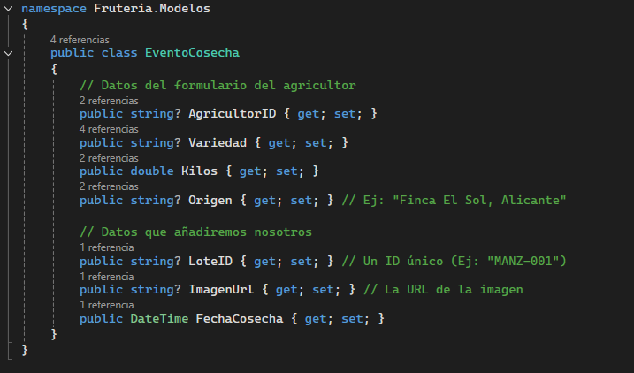
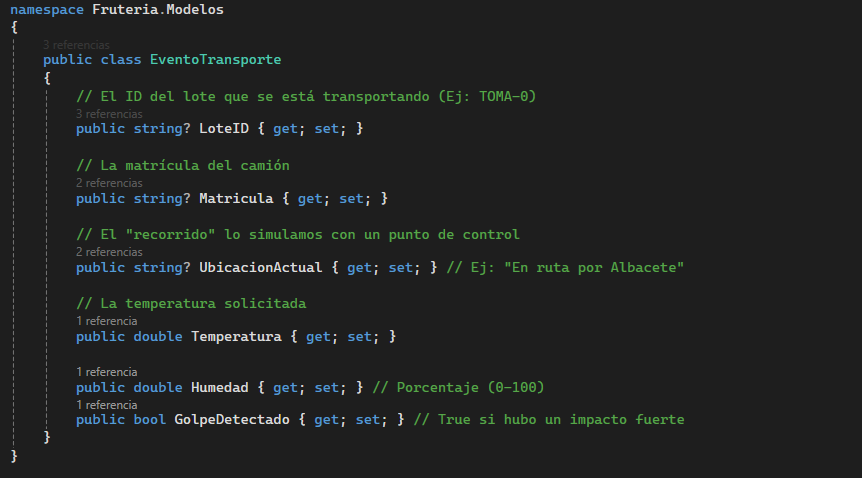

# Proyecto-Final-ASIR

FRUTERIA.MODELOS: BIBLIOTECA DE CLASES COMPARTIDA

Fruteria.Modelos es el proyecto diccionario de la solución CosechApp. Es una biblioteca de blases (.NET Class Library) que no ejecuta nada por sí misma, sino que define la estructura de los datos que viajan entre el servidor (API) y el cliente (web).

Su función principal es la siguiente: asegura que tanto el agricultor como la base de datos entiendan lo mismo cuando hablan de un Evento de cosecha o un Evento de transporte.

FICHA TÉCNICA

  - Tipo de proyecto: Biblioteca de clases (.dll)
  - Framework: .NET 8.0
  - Dependencias: Ninguna
  - Uso: Referenciado por Fruteria.API y Fruteria.WebAgricultor

CONTENIDO: MODELOS DE DATOS

El proyecto contiene las clases que definen la información del sistema.

  1. EventoCosecha.cs: Representa el origen de un lote de fruta. Contiene los datos que introduce el agricultor.

  2. EventoTransporte.cs: Contiene datos de seguimiento y telemetría IoT.

  3. Bloque.cs (Opcional en esta capa): A veces, la estructura del bloque de la cadena también se define aquí para ser compartida, aunque en este proyecto específico se ha mantenido dentro de la     API por simplicidad.

¿POR QUÉ SEPARAR LOS MODELOS?

Separar las clases en un proyecto Fruteria.Modelos tiene grandes ventajas:
  1. Evita duplicidad: No tienes que copiar y pegar la clase EventoCosecha.cs en la API y luego otra vez en la Web. Escribes el código una vez y lo usas en ambos sitios.
  2. Consistencia: Si cambias algo, el cambio se propaga automáticamente a la API y a la web al recompilar. Nunca tendrás versiones desincronizadas.
  3. Orden: Mantiene el código limpio. La API solo se preocupa de la lógica, la web solo del diseño, y los modelos solo de los datos.

Desarrollado por Joaquín García Carbonell como Proyecto Final de Segundo de ASIR.
